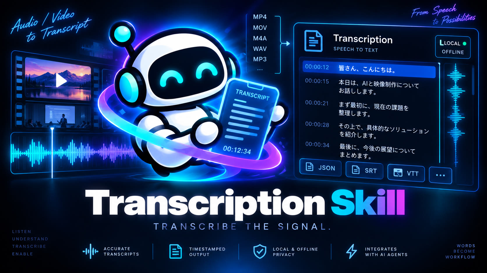

<p align="center">
  
</p>

<h1 align="center">transcription-skill</h1>

<p align="center"><strong>Audio / Video → Transcript.</strong> The speech-recognition layer of the video-production toolchain.</p>

<p align="center">
  Local faster-whisper · Offline mode · Timestamped segments and words · Deterministic cache · JSON contract for agents
</p>

<p align="center">
  <a href="https://github.com/kajisho5/transcription-skill/actions/workflows/tests.yml"></a>
  
  
  
  <a href="LICENSE"></a>
  <a href="https://github.com/sponsors/kajisho5"></a>
</p>

```bash
pip install "transcription-skill[faster-whisper] @ git+https://github.com/kajisho5/transcription-skill"
transcription transcribe lecture.mp4 --language ja
```

`transcription-skill` turns speech in an audio or video file into a **validated Transcript**: segments with
timestamps, optional word timestamps, language, confidence and full provenance, plus SpeechEvent-compatible
candidates for a production agent to reason about later. Recognition runs on this machine with
[faster-whisper](https://github.com/SYSTRAN/faster-whisper); nothing is uploaded, no API key exists.

**transcription-skill is not a video editing agent.** It does not decide what to cut, which camera to show,
where chapters go, who is speaking, or how captions should look. It turns speech into timestamped text and
stops there.

```
Audio / Video
    ↓
transcription-skill          (this repository)
    ↓
Transcript / SpeechEvent candidates
    ↓
video-production-agent       (inference, decisions, planning: a separate repository)
```

---

**Contents**
[Quick start](#quick-start) · [Why](#why-a-transcription-skill) · [Ecosystem](#ecosystem-process--measure--transcribe--decide) · [Engine ecosystem](#engine-ecosystem) · [CLI](#cli) · [Library / tool contract](#as-a-library--tool-contract) · [Transcript](#transcript-summary) · [Input boundary](#input-boundary-allowed-roots) · [Security and offline guarantees](#security-and-offline-guarantees) · [Invariants](#invariants) · [Boundaries](#where-this-skill-ends-and-others-begin) · [Agent connection](#future-connection-to-video-production-agent) · [Documentation](#documentation) · [Support](#support)

---

## Quick start

Requirements: Python 3.9+, FFmpeg (`ffmpeg` and `ffprobe` on PATH), and an ASR engine. The package core is
standard library only; the current **Reference Local Engine**, faster-whisper, is an optional dependency that
runs Whisper on this machine (CPU or GPU).

```bash
# install (or, from a checkout: pip install -e ".[faster-whisper]")
pip install "transcription-skill[faster-whisper] @ git+https://github.com/kajisho5/transcription-skill"

# check the machine: ffmpeg, engine, cached models, workspace, path policy
transcription doctor

# transcribe
transcription transcribe lecture.mp4                       # auto language, writes lecture.transcript.json
transcription transcribe lecture.mp4 --language ja         # Japanese, no detection
transcription transcribe lecture.mp4 --word-timestamps     # per-word timing
transcription transcribe lecture.mp4 --offline             # hard no-network constraint

# hand off
transcription export lecture.transcript.json --format srt -o lecture.srt
transcription segments lecture.transcript.json --merge-gap 0.5 --json   # SpeechEvent candidates
```

Recognition never uses the network. The `base` model (~145 MB) is fetched into the Hugging Face cache once, on
first use, or you place it there yourself for an air-gapped machine and run with `--offline`. Japanese and
English are first-class in the tests and evals; the engine supports 100 languages.

Example output (real run on the committed fixture, faster-whisper `base`):

```
ja_short.wav: 9.61s, language ja (requested), 1 segment(s), engine faster_whisper 1.2.1 model base
  00:00:00.000 --> 00:00:08.360  本日の公園を始めます 宜しくお願いします まず最初に会場の音教設備についてご説明します
```

The homophone errors (講演→公園, 音響→音教) are what a small Whisper model produces on synthetic speech.
The skill records them as-is: an ASR result is evidence, not an edited script.

## Why a transcription Skill

An agent that calls "whisper" directly gets a text dump with no identity, no provenance and no boundary. This
skill exists to make recognition a **reusable, verifiable data step**:

- **A Transcript is a contract, not a print-out.** Segments, words, language and provenance are validated
  before anything is returned; timestamps are checked against the media; a document that fails validation
  is never produced.
- **Engines are interchangeable, the contract is not.** faster-whisper is the implemented Reference Local
  Engine; every engine is described by the same `EngineSpec` (where it runs, whether it needs the network,
  which models are on disk) and picked by constraints, never by the skill's own opinion.
- **Same input, same result, no second run.** The cache key is the content fingerprint plus engine, model and
  parameters; a cached transcript is returned without starting an engine process.
- **Offline is a constraint, not a hope.** `--offline` refuses remote engines and any model download before
  anything runs.
- **Built to be called from another program.** `transcription run -` takes one JSON request on stdin and
  answers with exactly one JSON document; `transcription skill --json` publishes the tool and engine
  contract; input paths can be confined to allowed roots.

## Ecosystem: PROCESS · MEASURE · TRANSCRIBE · DECIDE

Each repository answers one question and stops there.

| repository | verb | question it answers | output |
|------------|------|--------------------|--------|
| [ffmpeg-skill](https://github.com/kajisho5/ffmpeg-skill) | **PROCESS** | how is the media transformed? | cuts, encodes, captions burnt in, delivery files |
| [media-analysis-skill](https://github.com/kajisho5/media-analysis-skill) | **MEASURE** | what exists in the media? | Observations: duration, streams, silence, loudness |
| **transcription-skill** | **TRANSCRIBE** | what is being said, and when? | Transcript, SpeechEvent candidates |
| [subtitle-skill](https://github.com/kajisho5/subtitle-skill) | **PRESENT** | how is it shown on screen? | subtitle files (SRT / WebVTT) from a typed request; burn-in delegated to ffmpeg-skill |
| [video-production-agent](https://github.com/kajisho5/video-production-agent) | **DECIDE** | what should be done with it? | inference, decisions, production plans |

A Transcript is a recognition result. It is **not an Event** (the agent lifts it into its timeline), **not a
Decision** (the agent makes those), and **not a Subtitle** (subtitle-skill renders those). The plain SRT/VTT
this skill can write are inspection views of the data, not subtitle design.

## Engine ecosystem

transcription-skill is a **transcription capability**, not a faster-whisper wrapper. Every engine is
described by the same machine-readable contract (`EngineSpec`: id, version, `execution_mode`,
`requires_network`, capabilities, languages, models and their availability), lives in a registry, and
is chosen by constraints, never by the skill's own judgement.

| engine | execution_mode | status |
|--------|----------------|--------|
| `faster_whisper` | `local` | **implemented**, verified on the fixtures (Reference Local Engine) |
| cloud ASR (any vendor) | `remote` | future possible engine: expressible by the contract, **not implemented** |
| whisper.cpp | `local` | future possible engine: expressible by the contract, **not implemented** |

**LOCAL vs REMOTE.** A `local` engine runs recognition on this machine; its only possible network use
is a one-time model download, reported per model as `MODEL_DOWNLOAD_REQUIRED` (or `MODEL_MISSING`
when downloads are impossible). A `remote` engine sends audio to another host and therefore has
`requires_network: true`. `--offline` is a hard constraint, not a preference: remote engines are
refused (`ENGINE_UNAVAILABLE`, reason `network_required`), a model that is not already on disk is
`MODEL_UNAVAILABLE` (`availability: MODEL_MISSING`), and the engine is told not to fetch anything.

```bash
transcription engines                          # EngineSpec of every registered engine
transcription engines --engine faster_whisper  # plus per-model availability
transcription engines --offline --language ja  # constraint filtering: candidates and per-engine rejection reasons
transcription doctor --offline                 # "ready to transcribe offline" only when the default model is local
```

Constraint filtering (`EngineRequirements` → `select_engines`) returns every engine that satisfies
the hard constraints and explains the rest; it never ranks. Picking among candidates is the caller's
decision. Adding an engine means implementing `TranscriptionEngine` and registering the class; there
is no plugin loader, and only implemented engines are registered.

| layer | owns | does not do |
|-------|------|-------------|
| Skill (`transcription-skill`) | transcription: request → Transcript | interpret, plan, decide |
| Engine (`faster_whisper`) | the recognition implementation | know about caches, budgets, other engines |
| Selector | constraint filtering with reasons | rank, prefer, choose |
| Agent (`video-production-agent`) | final policy: which candidate to adopt, whether remote is acceptable | import engine internals |

## CLI

```bash
transcription doctor                                   # engines, models, ffmpeg, workspace, cache
transcription transcribe lecture.mp4                   # auto language, writes lecture.transcript.json
transcription transcribe lecture.mp4 --language ja     # Japanese, no detection
transcription transcribe lecture.mp4 --word-timestamps # per-word timing
transcription transcribe lecture.mp4 --json            # one JSON document on stdout
transcription transcribe lecture.mp4 --dry-run         # what would run; no ASR
transcription check lecture.transcript.json            # validate against the contract
transcription export lecture.transcript.json --format srt -o lecture.srt
transcription segments lecture.transcript.json --merge-gap 0.5 --json   # SpeechEvent candidates
transcription skill --json                             # the skill / tool / engine contract (source of truth)
echo '{"tool":"transcription/transcribe","params":{"input":"lecture.mp4","language":"ja"}}' | transcription run -
                                                       # process-boundary transport: one JSON request in, one JSON response out
transcription transcribe lecture.mp4 --offline         # hard no-network constraint (local engine + local model only)
transcription engines --offline --language ja          # which engines satisfy these constraints
```

Exit codes: 0 success, 1 failure (structured error), 2 invalid input or file not found. With `--json`,
stdout carries exactly one JSON document, on success or on error; without it, errors go to stderr.

## As a library / tool contract

```python
from transcription_skill.skill import run_tool

res = run_tool("transcription/transcribe", {"input": "lecture.mp4", "language": "ja", "word_timestamps": True})
transcript = res["transcript"]                       # validated Transcript document (dict)
events = run_tool("transcription/segments", {"transcript": transcript, "merge_gap": 0.5})["events"]
run_tool("transcription/export", {"transcript": transcript, "format": "srt", "output": "lecture.srt"})
run_tool("transcription/check", {"transcript": "lecture.transcript.json"})
```

Tools: `transcription/transcribe`, `transcription/segments`, `transcription/export`, `transcription/check`.
Every parameter is typed JSON. A request that contains `command`, `argv`, `shell` or a credential is
refused with `INVALID_INPUT`. `transcription skill --json` returns the contract including every
registered engine's `EngineSpec` (schema `transcription-skill/engine-spec/0.1`); that JSON, not this
README, is what a consumer should read, and `tests/test_unit.py::ContractDriftTests` fails whenever
the contract and the implementation diverge (tools, engines, capabilities, schema versions).

`skill --json` also carries the fields the OS's `CapabilityContract` reads: `skill_id` (canonical identity;
`id` is kept for 0.2.0 consumers), `contract_version` (the shape's own version, `1.0`, independent of the
package version and bumped only for a breaking shape change), `dependencies` (empty: this Skill invokes no
other Skill), `not_provided` (machine-readable list of what it deliberately does not do) and `provides`.
`tests/test_conformance.py` runs all eight `SKILL_SPEC.md` conformance checks against this Skill's own
process boundary.

`skill --json` → `provides` publishes exactly one cross-repository Capability id:
`transcription/transcribe` → `transcribe.audio`, matching the id assigned to this Skill in
[`kajisho5/AI-video-production-OS`](https://github.com/kajisho5/AI-video-production-OS)'s
`docs/CAPABILITY_MATRIX.md`, so a registry can resolve "who provides `transcribe.audio`" without
hardcoding this repository. `segments`/`export`/`check` operate on a Transcript the caller already
has rather than producing a new one, so - like `thumbnail-skill`'s `validate` tool - they are not
published as a separate Capability; see `docs/decisions.md` ADR-026.

**Process boundary for external callers** (`transcription run -`): stdin carries one JSON object
`{"tool": "<name>", "params": {...}}`; stdout carries exactly one JSON document,
`{"ok": true, "tool": ..., "result": ...}` or `{"ok": false, "error": {"code", "message", "details"}}`.
`ok` says whether the tool ran; a tool's own verdict (for example `check`) is inside `result`. Invalid
or non-JSON stdin still yields an error document (exit 2), never a traceback. Diagnostics go to stderr.

## Transcript (summary)

```json
{
  "schema": "transcription-skill/transcript/0.1",
  "id": "tr_9fcee39be815",
  "asset_id": "asset_497b4b1eff55f6c0",
  "language": "ja", "language_source": "requested", "language_confidence": null,
  "duration": 9.606,
  "segments": [
    {"id": "seg_0001", "start": 0.0, "end": 8.36, "text": "本日の公園を始めます ...", "raw_text": "本日の公園を始めます ...",
     "confidence": 0.728, "words": [{"start": 0.0, "end": 0.5, "text": "本", "confidence": 0.986}], "speaker_id": null}
  ],
  "source": {"filename": "ja_short.wav", "fingerprint": "sha256:497b…", "size_bytes": 307470, "media_duration": 9.606, "has_video": false},
  "engine": "faster_whisper", "engine_version": "1.2.1",
  "created_at": "2026-09-04T18:09:36Z",
  "provenance": {"engine": "faster_whisper", "engine_version": "1.2.1", "execution_mode": "local", "model": "base", "model_version": "ebe41f70…",
                 "parameters": {"language": "ja", "beam_size": 5, "temperature": 0.0, "word_timestamps": true, "initial_prompt": null},
                 "parameters_hash": "6edc…", "cache_key": "301d…", "processing_seconds": 3.3, "skill_version": "0.2.0"},
  "warnings": []
}
```

Full definition, validation rules and the SpeechEvent record: [docs/transcript.md](docs/transcript.md).
JSON Schemas: [schemas/](schemas/).

## Input boundary (allowed roots)

An input path is untrusted. By default any readable regular file is accepted (unchanged behaviour).
Declare roots and the boundary is enforced:

```bash
transcription transcribe /jobs/123/media/lecture.mp4 --allowed-input /jobs/123/media
echo '{"tool":"transcription/transcribe","params":{"input":"lecture.mp4","allowed_input_roots":["/jobs/123/media"]}}' | transcription run -
transcription doctor --allowed-input /jobs/123/media --json     # path policy, cache root, tmp root, model cache root
```

Outputs get the same treatment: `--allowed-output DIR` (request key `allowed_output_roots` on
`transcription/export`) confines the transcript JSON, SRT/VTT and events files this skill writes; with or
without roots an output never overwrites an input or an existing directory.

With roots declared: the input is resolved (symlinks followed) and must sit inside a resolved root by
path components, never by string prefix (`/w/media` does not authorise `/w/media_evil`); any `..`
component in the raw path is refused; a symlink or junction whose target leaves the root is refused;
directories, missing files, broken links and special files are refused. Violations are `INVALID_INPUT`
with `details.reason` in `traversal` / `outside_allowed_roots` / `symlink_escape` / `not_regular_file`
(missing files stay `FILE_NOT_FOUND`), on the CLI and through `run -` alike.

| term | meaning | where |
|------|---------|-------|
| input | the media the caller names (untrusted) | anywhere the policy allows |
| allowed root | security boundary for inputs and, separately, for written outputs | `--allowed-input` / `allowed_input_roots`, `--allowed-output` / `allowed_output_roots` |
| workspace | operational directory: per-run `tmp/<id>/`, worker files | `--workspace` / `TRANSCRIPTION_WORKSPACE` |
| cache | derived transcripts, addressed by content key only | `<workspace>/transcripts/<sha256>.json` |
| model cache | the engine's models | `HF_HUB_CACHE` / `HF_HOME` only; never influenced by an input path |

## Security and offline guarantees

These are enforced by code and tests, not by convention (details: [docs/security.md](docs/security.md)).

| guarantee | how |
|-----------|-----|
| No shell, no command passthrough | every external call is a fixed argv list (`ffprobe`, `ffmpeg`, the engine worker); requests that carry `command`, `argv`, `shell` or a credential are refused; engine modules cannot spawn processes |
| No credentials anywhere | no cloud engine exists, so none is read; child processes get a minimal environment (`OPENAI_API_KEY`, `HF_TOKEN` and the like are not forwarded); transcripts, contract and doctor output are scanned for credential-shaped strings |
| Offline is a hard constraint | `--offline`: remote engines → `ENGINE_UNAVAILABLE`, a model not on disk → `MODEL_UNAVAILABLE` (`MODEL_MISSING`), the engine loads with `local_files_only`; nothing is downloaded |
| Network for recognition vs. network for a model download | separate facts: `EngineSpec.requires_network` (false for faster-whisper) and per-model `ModelStatus.availability` |
| Untrusted input paths | with allowed roots: resolved path must sit inside a resolved root by path components, `..` refused, symlink/junction escapes refused, special files refused; default behaviour unchanged |
| Input never steers other locations | model cache comes from `HF_HUB_CACHE`/`HF_HOME` only; temporary files live in an exclusive `<workspace>/tmp/<uuid>/` verified inside the workspace; cache entries are addressed by content key only |
| Cache identity is explicit | key = content fingerprint + engine id/version/execution mode + model/model version + parameters; corrupt or tampered entries are recomputed, never served |
| Provenance is complete | engine, engine version, execution mode, model, model revision, parameters and their hash, cache key, skill and tool, created_at |
| Timeouts kill for real | the engine runs in its own process group; `budget.timeout` ends it; `max_audio_seconds` refuses long media before extraction |
| One JSON document on stdout | every `--json` command and `run -` print exactly one document, on success and on error; malformed stdin yields an error document, never a traceback |

## Invariants

1. transcription-skill owns speech recognition.
2. An Engine owns a recognition implementation.
3. The Selector filters by constraints and does not rank.
4. The Agent owns final policy and decisions, including which engine to adopt.
5. A Transcript is a recognition result: not an Event, not a Decision, not a Subtitle.
6. Cache identity includes engine identity (id, version, execution mode) and model identity.
7. Offline means no network use for the operation, model acquisition included.
8. Engine availability and model availability are separate facts.
9. The Agent does not import engine internals; it reads the JSON contract.
10. An input path is untrusted; a string prefix never authorises it; the resolved path must be inside a resolved allowed root; symlink or junction escapes do not bypass the root.
11. An input path never controls the model cache location or where temporary output is written; declared output roots confine what the skill writes for the caller.
12. Path policy and cache identity are separate: identity stays content/engine/model/parameters.
13. `run -` and the direct CLI share one validation boundary; an agent adapter cannot bypass it.

## Where this skill ends and others begin

| Repository | Question it answers | Example |
|------------|--------------------|---------|
| **media-analysis-skill** | What exists in the media? (measurement) | `duration = 312.4`, `audio_channels = 2`, `silence = [...]` |
| **transcription-skill** | What is being said, and when? (recognition) | `"本日の講演を始めます"  start 12.3  end 15.8` |
| [**subtitle-skill**](https://github.com/kajisho5/subtitle-skill) | How is it shown on screen? (subtitle artifact) | typed subtitle request → validated SRT / WebVTT; burn-in delegated to ffmpeg-skill |
| **video-production-agent** | What should be done with it? (inference, decisions, planning) | "cut the pause", "switch to camera B while speaker A talks", chapters |

transcription-skill produces plain SRT/VTT views of a transcript because they are useful for
inspection and hand-off. Reading-speed rules, line breaking, positioning, fonts and burn-in are
subtitle-skill's job; nothing here styles a subtitle. Silence measurement, loudness and stream facts
are media-analysis-skill's job; this skill only probes what it needs (duration, audio presence) to
transcribe. Any interpretation of the text is the agent's job.

What this repository deliberately does not contain: an AI provider, prompts, reasoning, decisions,
approvals, production plans, speaker diarization or identification, semantic segmentation, chapter
generation, subtitle styling, video editing, plugin loading, cloud ASR clients, HTTP clients,
credentials, a "best engine" chooser, and arbitrary command execution.

## Future connection to video-production-agent

```
video-production-agent
    ↓  SkillPackage / ToolSpec  (reads `transcription skill --json`: tools + EngineSpec list)
transcription/transcribe        (typed JSON request; `engine`, `offline` are constraints the agent sets)
    ↓  Engine Resolver          (select_engines: constraint filtering, no ranking)
faster_whisper  |  future remote engine
    ↓
Transcript                      (provenance: engine, engine_version, execution_mode, model, model_version)
    ↓  agent-side adapter
Agent Observation / Event       (SpeechEvent candidates lifted into the agent's Event model)
```

The agent's `SkillRegistry` describes skills by name, version, inputs, outputs, required capabilities
and tools; `transcription skill --json` exposes exactly that, plus each engine's `execution_mode`,
`requires_network` and model availability so the agent's capability resolver can treat "local ASR
available" and "offline-capable" as facts. An adapter on the agent's side would call
`transcription/transcribe` as a process (`--json` on stdout, the same contract ffmpeg-skill uses),
store the Transcript as an Observation, and lift `transcription/segments` output into its `Event`
model. The SpeechEvent record here mirrors that shape without importing it; the agent is not a
dependency of this repository and no adapter is added to the agent in this version. Which engine to
use, and whether a remote one is acceptable for a given production, is the agent's decision.

## Documentation

- [SKILL.md](SKILL.md): how a coding agent should use the skill
- [docs/architecture.md](docs/architecture.md): modules, data flow, boundaries
- [docs/transcript.md](docs/transcript.md): the Transcript, Segment, Word and SpeechEvent contracts
- [docs/engines.md](docs/engines.md): engine contract, the faster-whisper reference engine, models, languages
- [docs/security.md](docs/security.md): execution boundary, credentials, paths, validation
- [docs/testing.md](docs/testing.md): unit, security, integration, evals; fixtures
- [docs/decisions.md](docs/decisions.md): architecture decision records

## Support

If this skill saves you time, you can help keep it maintained through [GitHub Sponsors](https://github.com/sponsors/kajisho5). Issues and pull requests are just as welcome.

## License

MIT
